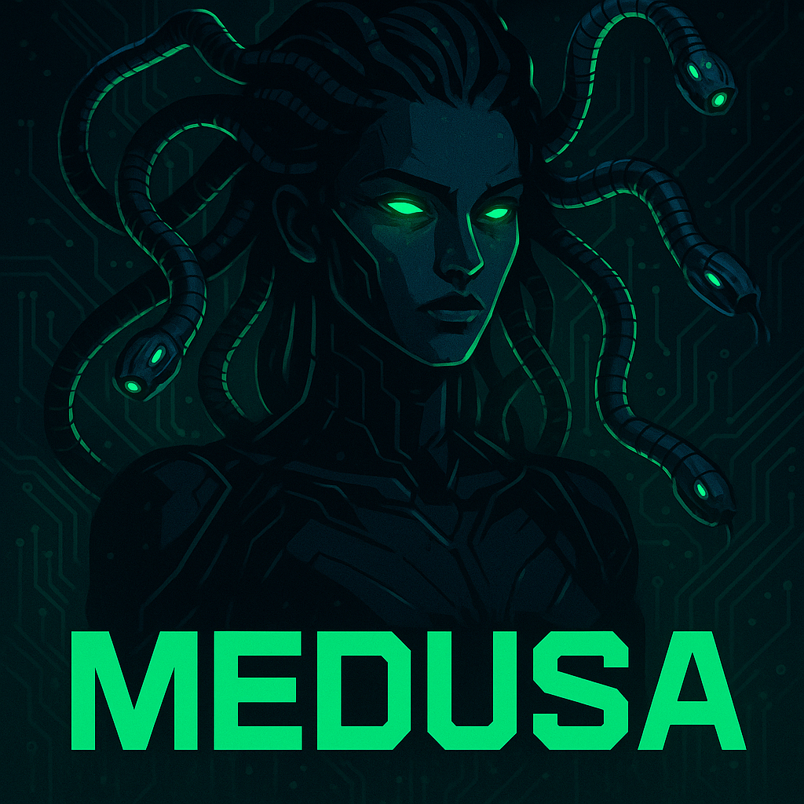

# Medusa AntiCheat

<p align="center">
  
</p>

Medusa AntiCheat is a proof-of-concept anti-cheat system built for **learning Windows kernel development** and experimenting with advanced process monitoring and injection detection techniques.

## System Architecture

The system consists of four main components:

### 1. **Kernel Driver** (`MedusaKernelDriver`)
- **ObCallbacks**: Monitor handle operations and object access
- **Notify Routines**: Track process/thread creation and image loading
- **Minifilter**: File system operation monitoring
- **Communication Port**: Bi-directional IPC with userland via `\MedusaComPort`
- **Unified Event Structure**: Uses `ACEvent` struct for all kernel-to-userland communication

### 2. **Userland Agent** (`MedusaUserlandAgent`)
- **Event Processing**: Receives and processes kernel events in real-time
- **DLL Injection**: Automatically injects monitoring DLL into new processes
- **WebSocket Client**: Streams events to backend for analysis and storage
- **Process Scoring**: Evaluates suspicious behavior patterns
- **Event Translation**: Converts kernel events to unified format for backend

### 3. **Monitoring DLL** (`MedusaUserDLL`)
- **API Hooking**: Uses MinHook to intercept critical Windows APIs
- **IPC Communication**: Reports hooked function calls back to userland agent
- **Injection Detection**: Monitors `CreateRemoteThreadEx` and other injection APIs
- **Unified Reporting**: Uses same `ACEvent` structure as kernel components

### 4. **Backend Server** (`MedusaBackend`)
- **WebSocket Server**: Real-time event ingestion from userland agents
- **Event Processing**: Handles binary `ACEvent` structures via WebSocket
- **Detection Engine**: Multiple specialized detectors for different attack patterns
- **Real-time Analysis**: Processes events as they arrive for immediate threat detection

## Current Detection Capabilities

### Kernel-Level Monitoring
- **Process Creation/Termination**: Track all process lifecycle events
- **Thread Creation**: Monitor thread creation across all processes
- **Handle Operations**: Detect suspicious handle access patterns
- **Image Loading**: Monitor DLL/module loads via LoadImage notifications
- **File System Activity**: Track file operations through minifilter

### Userland Hooking
- **CreateRemoteThreadEx**: Detect DLL injection attempts
- **LoadLibraryW**: Monitor dynamic library loading
- **Process Memory Operations**: Track `VirtualAllocEx`, `WriteProcessMemory`

### Event Streaming & Backend
- **Real-time Event Stream**: WebSocket connection to backend (`MedusaBackend`)
- **Image Load Detection**: Specialized detector for monitoring protected processes
- **Event Enrichment**: Add process metadata and context to events

## How It Works

1. **Initialization**: Userland agent takes target PID and DLL path as arguments
2. **Driver Communication**: Connects to kernel driver via minifilter port `\MedusaComPort`
3. **Process Injection**: Automatically injects monitoring DLL into all new processes
4. **Event Collection**: Kernel driver sends events (process, thread, handle, file operations)
5. **API Monitoring**: Injected DLL hooks critical APIs and reports calls via IPC
6. **Backend Streaming**: All events forwarded to WebSocket backend for analysis
7. **Real-time Detection**: Events processed and suspicious patterns flagged

## Unified Event Structure

All components now use a unified `ACEvent` structure for consistent event reporting:

```c
typedef struct _ACEvent {
    enum EventSource src;        // KM (Kernel), UM (Userland), DLL
    wchar_t EventType[260];     // Event type (e.g., "CreateProcess")
    int CallerPID;              // Process ID of event caller
    int TargetPID;              // Target process ID
    int ThreadID;               // Thread ID involved
    int ImageFileName[260];     // Process/image file name
    wchar_t CommandLine[1024];  // Command line arguments
    int IsCreate;               // Creation (1) or termination (0)
    PVOID ImageBase;            // Base address of loaded image
    ULONG ImageSize;            // Size of loaded image
} ACEvent;
```

### Event Sources
- **`KM`**: Events originating from kernel driver
- **`UM`**: Events from userland agent
- **`DLL`**: Events from injected monitoring DLL

## Event Types Monitored

- **`PROC_TAG`**: Process creation/termination events
- **`THREAD_TAG`**: Thread creation events
- **`OB_TAG`**: Object handle operation events
- **`FLT_TAG`**: File system minifilter events
- **`LOADIMG_TAG`**: Image/DLL load events

## Usage

### 1. Start the Backend Server
```bash
cd MedusaBackend
go run Main.go WSServer.go Event.go
# Backend listens on :8080 for WebSocket connections
```

### 2. Load Kernel Driver and Run Agent
```bash
# Compile and load kernel driver
# Run userland agent with target PID, WebSocket URL, and DLL path
./MedusaUserlandAgent.exe <target_pid> <websocket_url> <dll_path>

# Example:
./MedusaUserlandAgent.exe 1234 ws://localhost:8080/ ./MedusaUserDLL.dll
```

### 3. Monitor Events
The backend will receive and process events in real-time, displaying them in JSON format while running detection algorithms.  

## PoC Disclaimer
This project is not production-ready. A real anti-cheat would also need:
- Obfuscation and encryption
- Secure backend persistence
- Hardened communication

These are skipped here since the focus is on prototyping and experimenting with kernel ↔ userland interaction.

## Why?
Anti-cheat development combines kernel security, Windows internals, and attack surface analysis.  
This project is my playground to explore these concepts while building something functional.

---

⚠️ **Disclaimer**: This is a learning project. Do not expect production-grade security.  
